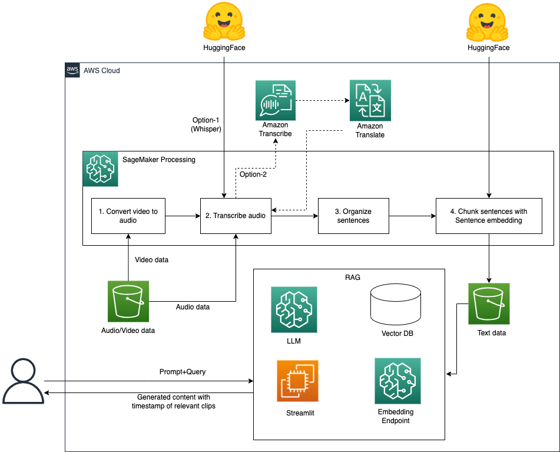
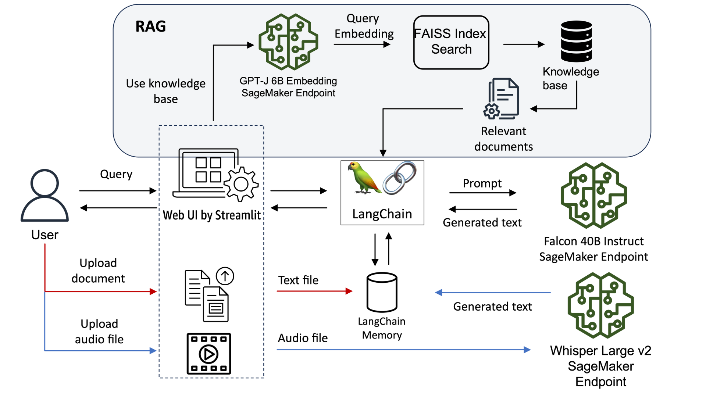

# AWS-SageMaker-Multimedia-RAG-Framework

> **⚠️ Important Note:** AWS has migrated to the new SageMaker Studio. For users experiencing migration issues or needing to revert to the classic view, please refer to the [official migration documentation](https://docs.aws.amazon.com/sagemaker/latest/dg/studio-updated-migrate-ui.html#studio-updated-migrate-revert).

## Overview

Traditional LLM solutions like RAG and ChatBots primarily support text data sources, leaving a significant gap for organizations with extensive video and audio content. However, multimedia data represents one of the most important knowledge bases for organizations, and it's typically harder to search and extract information from than text.

In this project, I have provided a comprehensive solution for implementing generative AI on video and audio data with two primary use cases:

1. **Enterprise Knowledge Enhancement**: Organizations can enrich their knowledge bases with existing video/audio data, making RAG more effective at retrieving relevant information.

2. **Efficient Information Retrieval**: Users can quickly find specific information and navigate to relevant sections in video/audio files, saving significant time.

I have demonstrated how to integrate these outputs into RAG solutions using [ Question answering using Retrieval Augmented Generation with foundation models in Amazon SageMaker JumpStart](https://aws.amazon.com/blogs/machine-learning/question-answering-using-retrieval-augmented-generation-with-foundation-models-in-amazon-sagemaker-jumpstart/). For OpenSearch integration, you can refer to [Build a powerful question answering bot with Amazon SageMaker, Amazon OpenSearch Service, Streamlit, and LangChain](https://aws.amazon.com/blogs/machine-learning/build-a-powerful-question-answering-bot-with-amazon-sagemaker-amazon-opensearch-service-streamlit-and-langchain/) for modifications.

## Architecture

<div align="center">

<p><em>Solution Architecture</em></p>
</div>

## Workflow

The solution consists of three main components:

1. **Convert video to text with Speech-to-text model and sentence embedding model**
2. **Intelligent video search using Retrieval Augmented Generation (RAG)**
3. **Multi-functional chatbot with Amazon SageMaker**

## Part 1: Data Preparation

I use Whisper to transcribe video and audio data, and implement sentence embedding approaches to chunk sentences intelligently.

This notebook handles:

- Downloading video content
- Processing with SageMaker Processing Jobs on GPU instances
- Transcribing using Whisper models
- Splitting videos into clips and transcripts into chunks
- Storing all prepared data in S3

**Get Started**: [Data Preparation Notebook](data_preparation.ipynb)

## Part 2: Intelligent Video Search

I use data transcribed from video/audio files to build a RAG solution with LangChain. This allows users to:

- Ask natural language questions about video content
- Get precise answers with supporting evidence
- Jump directly to relevant video sections using timestamps
- Leverage foundation models for intelligent retrieval

**Get Started**: [Question Answering Notebook](video_question_answering_langchain.ipynb)

## Part 3: Multi-functional Chatbot

<div align="center">

<p><em>Chatbot Solution Architecture</em></p>
</div>

I have demonstrated how to use Streamlit, LangChain, and SageMaker to build a multi-functional chatbot that provides an interactive experience for users.

### Deployment Guide

To run the Streamlit application:

1. Update endpoint names in environment variables
2. Open a terminal in SageMaker Studio
3. Navigate to the cloned repository folder
4. Run these commands:

```bash
export falcon_ep_name=<your-falcon-endpoint-name>
export wp_ep_name=<your-whisper-endpoint-name>
export embed_ep_name=<your-embedding-endpoint-name>
streamlit run app_chatbot/chatbot.py --server.port 6006 --server.maxUploadSize 6
```

To access the Streamlit UI, copy your SageMaker Studio URL and replace `lab?` with `proxy/6006/`:

```
https://<domain-id>.studio.<region>.sagemaker.aws/jupyter/default/proxy/6006/
```

## Sample Data

I've provided sample data for testing:

- [Video Sample](test_raw_data/demo-video-sagemaker-doc.mp4)
- [Audio Sample](test_raw_data/test.webm)

## Security

If you discover a security vulnerability, please contact me directly at [harshendra131@gmail.com](mailto:harshendra131@gmail.com) rather than opening a public issue. I take security seriously and will address concerns promptly.

## License

This project is licensed under the MIT-0 License. See the [LICENSE](LICENSE) file for details.

---

**Created by [Harshendram](https://github.com/harshendram)**
